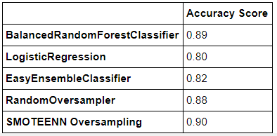
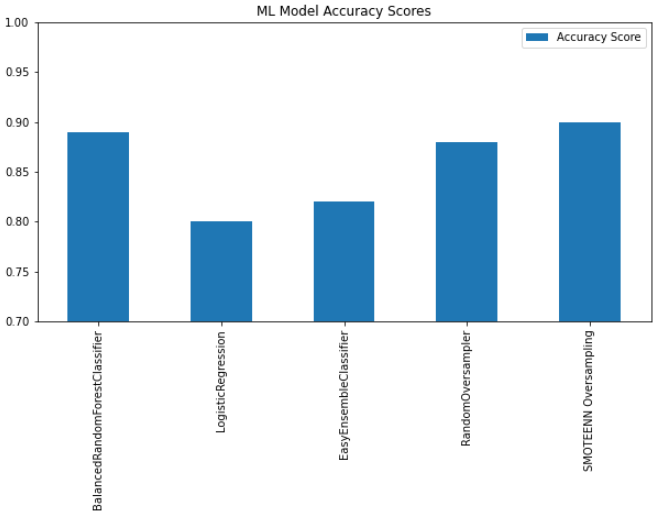

# The Hotel Dilemma

## **Motivation**

- After a 1-year pandemic, we all need a vacation...
- Conduct a project using python + machine learning related to supply chain management and demand forecasting, which led to a very interesting prompt related to forecasting hotel reservation cancellations. 

## **Research Questions**
- Using data and machine learning models, can hotel reservation cancellations be predicted?
- If yes to the above question, what models and methods most accurately predict hotel reservation cancellations?

## **Objectives**
- Build a ML model that can predict whether a hotel reservation will be cancelled 
- Analyze and understand data via organization, visualization, and dashboards

## **Data Sources**
- [Hotel Booking Demand](https://www.kaggle.com/jessemostipak/hotel-booking-demand)

## **Action Items**
- Data Cleaning & Shaping
  - Data comes from/affiliated with an article: Hotel Booking Demand Datasets 
  - Is there further noise/info to weed out? Label encoding?
- Machine Learning Model
  - Which model to use (try multiple models)
  - Ensemble/Classifier/Decision Tree/Regression? Pick several and also apply resampling techniques if needed. 
  - Which parameters/inputs produce the best outcomes (train/test split; different inputs for each ML model type aka reference documentation; which models are most efficient; what features in the dataset can we eliminate)
  - Look at data in different ways? Is the model/data better for predicting in the summer/winter/fall/etc? 
- Data Visualization 
  - Visualize by city hotel & resort hotel
  - Visualize by season
  - Visualize different demographics
  - Visualize different ML model outcomes
  - Explore other means and methods of visualization that may give unique insight into the data set

## **Work Assignments**
- ML Models & Workbook
- Data Visualizations & Dashboard
- Slide Show 

## **Technologies**
- Jupyter lab
- Python
- Pandas
- Numpy
- Sklearn
- Pyviz
- More to be imported and utilized in our python files

## **Attachments**
- [Analysis Folder](Analysis/final_analysis.ipynb) - ML python files
- [Visualizations Folder](Visualizations/Dashboard.ipynb) - visualization python files
- [Data Folder](Data/hotel_bookings.csv)- original data set
- Final presentation deck

## **Outcomes**
- Using machine learning models, our Team was able to predict hotel cancellations with confidence (particularly using the SMOTEENN Resampling + BalancedRandomForestClassifier model, which rendered a ~90% accuracy score).

